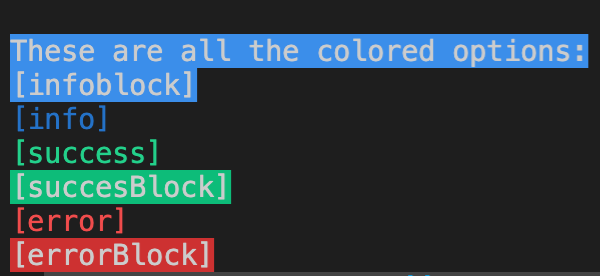

# ASCII color log 
This package is an opiniated log function to create colored log message in CLI. The primary goal for this package is to create colored logs in a gitlab pipeline. By creating colered logs it is easier to read if something has gone wrong, or offcourse if everything is allright.

## Available colors
It is a JS class to be used in your script.




## Howto use in your project
These are two examples how you can use this lib for your project. This are the available coloring options: success, successBlock, info, infoBlock, error, errorBlock.

### CommonJS
```javascript
const ASCIIColorLog = require('ascii-color-log');
const log = new ASCIIColorLog();

log.success('This is a success log')
```


### Module
```javascript
import ASCIIColorLog from 'ascii-color-log.js';
const log = new ASCIIColorLog();

log.success('This is a success log')
```
